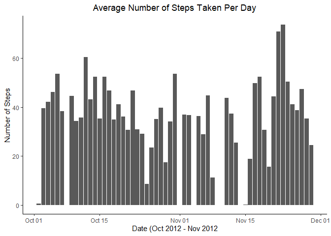

## Loading and preprocessing the data


```r
unzip("activity.zip")
data <- read.csv("activity.csv", header = TRUE)
head(data)
```

```
##   steps       date interval
## 1    NA 2012-10-01        0
## 2    NA 2012-10-01        5
## 3    NA 2012-10-01       10
## 4    NA 2012-10-01       15
## 5    NA 2012-10-01       20
## 6    NA 2012-10-01       25
```

```r
data$date <- as.Date(data$date)
```


## What is mean total number of steps taken per day?

```r
mean_steps <- summarise(group_by(data, date), steps = mean(steps, na.rm = TRUE))
```

```
## `summarise()` ungrouping output (override with `.groups` argument)
```

```r
g <- ggplot(mean_steps, aes(x = date, y = steps)) + geom_bar(stat = "identity") +
  xlab("Date (Oct 2012 - Nov 2012") +
  ylab("Number of Steps") +
  ggtitle("Average Number of Steps Taken Per Day") +
  theme_classic() +
  theme(plot.title = element_text(hjust = 0.5))
  
g
```

```
## Warning: Removed 8 rows containing missing values (position_stack).
```

<!-- -->


## What is the average daily activity pattern?


## Imputing missing values


## Are there differences in activity patterns between weekdays and weekends?
