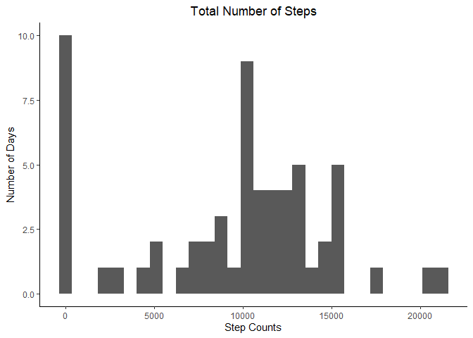
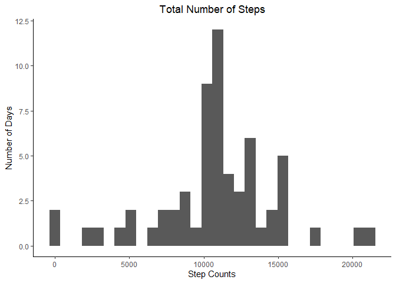
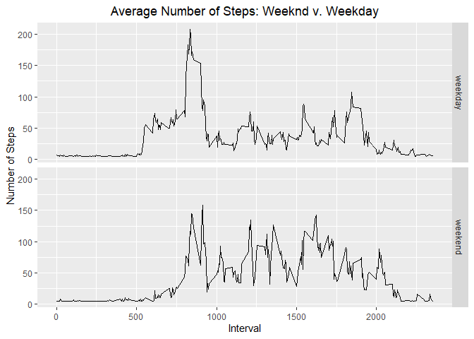

## Loading and preprocessing the data


```r
unzip("activity.zip")
data <- read.csv("activity.csv", header = TRUE)
head(data)
```

```
##   steps       date interval
## 1    NA 2012-10-01        0
## 2    NA 2012-10-01        5
## 3    NA 2012-10-01       10
## 4    NA 2012-10-01       15
## 5    NA 2012-10-01       20
## 6    NA 2012-10-01       25
```

```r
data$date <- as.Date(data$date)
data$steps[data$steps == 0] <- NA
```


## What is mean total number of steps taken per day?

```r
mean_steps <- summarise(group_by(data, date), steps = mean(steps, na.rm = TRUE))
```

```
## `summarise()` ungrouping output (override with `.groups` argument)
```

```r
sum_steps <- summarise(group_by(data, date), steps = sum(steps, na.rm = TRUE))
```

```
## `summarise()` ungrouping output (override with `.groups` argument)
```

```r
g <- ggplot(sum_steps, aes(x = steps)) + geom_histogram() +
  xlab("Step Counts") +
  ylab("Number of Days") +
  ggtitle("Total Number of Steps") +
  theme_classic() +
  theme(plot.title = element_text(hjust = 0.5))
  
g
```

```
## `stat_bin()` using `bins = 30`. Pick better value with `binwidth`.
```

<!-- -->

```r
mean_total <- mean(sum_steps$steps, na.rm = TRUE)
median_total <- median(sum_steps$steps, na.rm = TRUE)

print(paste("The mean value of steps per day:", round(mean_total,2)))
```

```
## [1] "The mean value of steps per day: 9354.23"
```

```r
print(paste("The median value of steps per day:", median_total))
```

```
## [1] "The median value of steps per day: 10395"
```


## What is the average daily activity pattern?

```r
interval_data <- summarise(group_by(data, interval), steps = mean(steps, na.rm = TRUE))
```

```
## `summarise()` ungrouping output (override with `.groups` argument)
```

```r
interval_plot <- ggplot(interval_data, aes(x = interval, y = steps)) + geom_line() +
  ggtitle("Mean Steps per 5 Minute Interval") +
  theme_classic() +
  xlab("5 Minute Interval") +
  ylab("Mean Steps") +
  theme(plot.title = element_text(hjust = 0.5))
interval_plot
```

<!-- -->

```r
print(paste("The interval containing the most steps on average: ", interval_data$interval[which.max(interval_data$steps)]))
```

```
## [1] "The interval containing the most steps on average:  835"
```

```r
print(paste("The average number of steps per that interval: ", round(max(interval_data$steps, na.rm = TRUE), 2)))
```

```
## [1] "The average number of steps per that interval:  352.48"
```


## Imputing missing values


```r
data_NA <- read.csv("activity.csv")

print(paste("The number of NA values in this dataset are: ", sum(is.na(data_NA$steps))))
```

```
## [1] "The number of NA values in this dataset are:  2304"
```
### Missing Data Strategy

We can utilize the impute function in R. We will use the means to impute the missing values.


```r
data_NA$steps <- impute(data_NA$steps, fun = mean)

sum_steps_NA <- summarise(group_by(data_NA, date), steps = sum(steps, na.rm = TRUE))
```

```
## `summarise()` ungrouping output (override with `.groups` argument)
```

```r
g <- ggplot(sum_steps_NA, aes(x = steps)) + geom_histogram() +
  xlab("Step Counts") +
  ylab("Number of Days") +
  ggtitle("Total Number of Steps") +
  theme_classic() +
  theme(plot.title = element_text(hjust = 0.5))

g
```

```
## `stat_bin()` using `bins = 30`. Pick better value with `binwidth`.
```

<!-- -->

```r
mean_total_NA <- mean(sum_steps_NA$steps, na.rm = TRUE)
median_total_NA <- median(sum_steps_NA$steps, na.rm = TRUE)

print(paste("The mean value of steps per day:", round(mean_total_NA,2)))
```

```
## [1] "The mean value of steps per day: 10766.19"
```

```r
print(paste("The median value of steps per day:", round(median_total_NA, 2)))
```

```
## [1] "The median value of steps per day: 10766.19"
```
The value for the mean and median end up being the same in this data set because the imputation method massages the data set to be much more symmetrical around the mean value. It suppresses the large number of 0 values in the original data set and feeds in the mean value for those days into the spaces that 0's where found. This forces the mean to increase but also pushes the median value up because of the much larger presence of mean values.

## Are there differences in activity patterns between weekdays and weekends?


```r
data_we <- data_NA
data_we$date <- as.Date(data_we$date)
data_we$day <- ifelse(weekdays(data_we$date) %in% c("Saturday", "Sunday"), "weekend", "weekday")
data_we$day <- as.factor(data_we$day)


weekend <- filter(data_we, data_we$day == "weekend")
weekday <- filter(data_we, data_we$day == "weekday")

weekend <- summarise(group_by(weekend, interval), steps = mean(steps))
```

```
## `summarise()` ungrouping output (override with `.groups` argument)
```

```r
weekday <- summarise(group_by(weekday, interval), steps = mean(steps))
```

```
## `summarise()` ungrouping output (override with `.groups` argument)
```

```r
weekend$day <- "weekend"
weekday$day <- "weekday"

combined <- rbind(weekend, weekday)
combined$day <- as.factor(combined$day)

g <- ggplot(combined, aes(interval, steps))
g + geom_line() +
  facet_grid(day~.) +
  xlab("Interval") +
  ylab("Number of Steps") +
  ggtitle("Average Number of Steps: Weeknd v. Weekday") +
  theme(plot.title = element_text(hjust = 0.5))
```

<!-- -->
The above chart shows the differences between weekend and weekday activity. We can see right away that the weekend activity is consistently higher than weekday activity throughout the midday. We also see large spikes of activity during the weekday in the morning presumable when people are going to work or moving to prepare for the day. 


